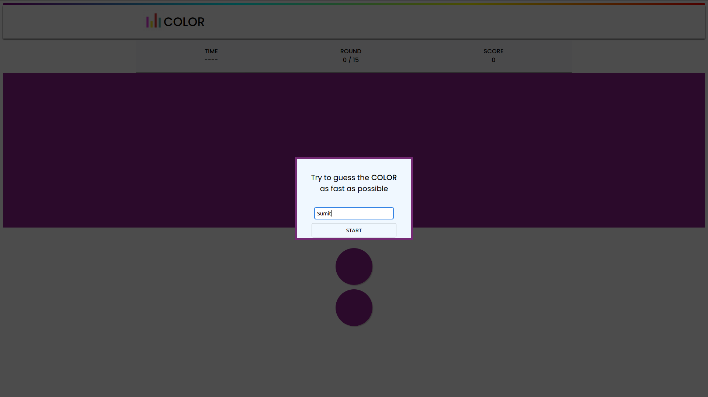
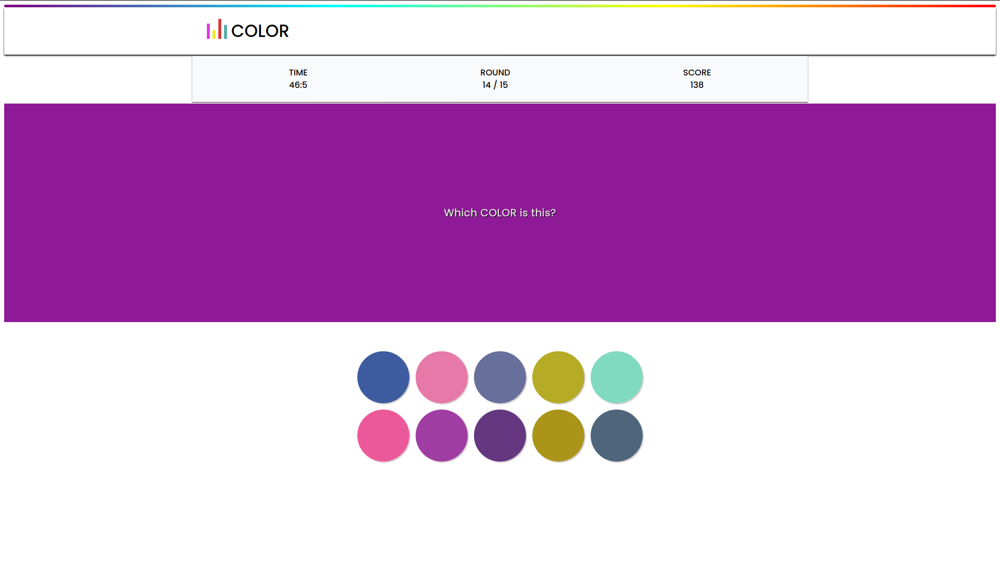
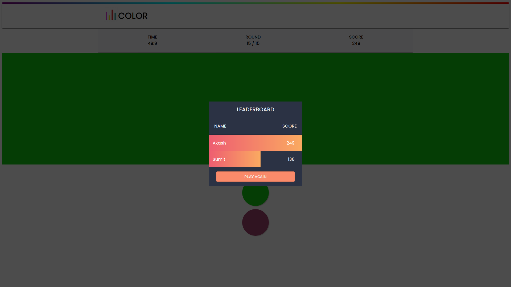

# Color-game

## FRONT-END Based Project :
 
This project is create using basic FRONT-END languages.\
• This is created using HTML, CSS, JavaScript languages which are the basic.

## FRONT-END :
FRONT-END development is the development of those elements of a website that the customer sees and interacts with directly.

## HTML :
HyperText Markup Language is the standard markup language used to create web pages.\
It is written in the form of HTML elments consisting of tag enclosed in
angles brackets.

## CSS :
Cascading Style Sheets is a style sheet language used for describing the look and formatting of a document written in a markup language.

## JavaScript :
JavaScript is a client scripting language which is used for creating web pages.\
It also allows to make webpage to be dynamic and add special effects.

# FEATURES :
It helps players to focus more and think fast due to guessing time.\
Players can compete with each other and try to get the highest score.\
A leaderboard help to display players scores.

## Name Field For Player :
The look and creation of elements is done by HTML and CSS.\
Basic logic and adding entered name to leaderboard is done by JavaScript.

## Dynamic Difficulty : 
More color combinations are generated dynamically as level increases.\
After every fixed time random new set of colors are genertated.

## MultiPlayer :
After end of every round select New Player to play again and compete.\
End Game Shows LeaderBoard with all players playing simultaneously.

